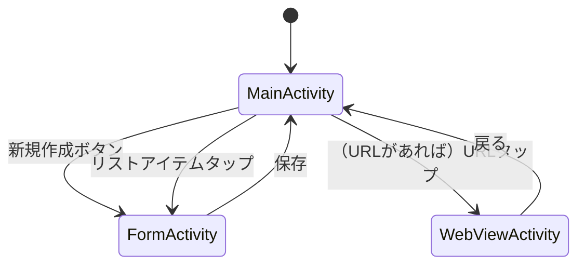

# Member List Android App

## 概要

これは、ユーザー情報を管理するための Android アプリケーションです。

## 主な機能

1. **メンバー情報の管理**
   - 名前、年齢、URL の追加・編集・削除
   - 入力データのバリデーション
2. **メンバーリストの表示**
   - カスタム ListView を使用した効率的なリスト表示
   - メンバー情報の視覚的に分かりやすい表示
3. **WebView の表示**
   - メンバーの URL をタップしてアプリ内で Web ページを表示
   - セキュアなブラウジング（HTTPS を強制）
4. **データの永続化**
   - SharedPreferences を使用したローカルデータ保存
   - Gson を利用した JSON シリアライゼーション

## 画面遷移図

## 使用技術

- 言語: Kotlin
- 最小 SDK: API 30 (Android 11)
- ターゲット SDK: API 34 (Android 14)
- データ保存: SharedPreferences, Gson 2.11.0
- UI: Material Components for Android 1.10.0

## 今後の改善点

- 保存データ項目の拡充:
  - 長い文字列や画像に対応
- メンバー情報による検索:
  - 名前や URL でメンバーの検索
- データの入出力:
  - インポート・エクスポート機能の追加
- テストの拡充:
  - ユニットテストや UI テストの更なる追加
- データ保存の最適化:
  - データベースを使用したより堅牢なデータ永続化
- 大規模データ対応:
  - ページネーションを用いた大量データの効率的な処理
  - 仮想化リストビューの実装
- エラーハンドリングの改善:
  - データ読み込みエラーなどに対するエラーハンドリングの強化
- UI/UX の向上:
  - 削除確認ダイアログや入力時のリアルタイムバリデーションの追加
- アクセシビリティ:
  - TalkBack などの支援技術への対応強化
- 多言語対応:
  - 複数言語のサポート追加

## ライセンス

このプロジェクトは MITライセンス の下で公開されています。